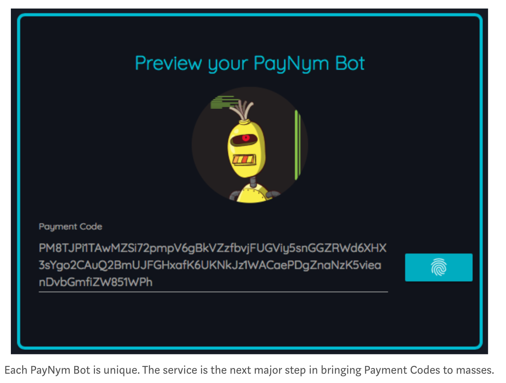

- BTC Traceability
  - By on-chain data.
  - By off-chain but public data. Surveillance
  - Subpoena
- Ledger obfuscation
  - Stealth Addresses
    - Unlink off-chain payment address with on-chain addressess.
  - CoinJoins
    - Input Mixins, known amounts
  - Confidential Transactions (CT)
    - Input Mixins, and unknown amounts
  - Chaum E-Cash
    - ZeroKnowledge Commitment & Reveal schemes.

* BTC Mixers
* Altcoins
  - Monero (CoinJoin)
  - ZeroCoin & ZCash (eCash)
  - MimbleWimble (eCash)
    - Proof aggregation to shrink the chain.
* ZCash traceability
* Monero traceability
* Zero Knowledge Smart Contract
  - ETH ZK-Mixer
* Crypto
  - Schnnor Signatures
  - ZK-Snark
  - ZK-Stark
  - Bullet Proof

# Bitcoin On-Chain Traceability

A good introduction to the basics of on-chain analysis is [A Fistful of Bitcoins: Characterizing Payments AmongMen with No Names](https://cseweb.ucsd.edu/~smeiklejohn/files/imc13.pdf).

There are two basic heuristics to cluster addresses as belonging to the same user:

- Heuristic 1: Inputs to a tx belong the same user.
  - Active probe: sending small UTXOs to known addresses.
- Heuristic 2: change addresses belong the the senders.

Furthermore, by interacting with services (sending or receiving money), it's possible to label some initial set of addresses as belonging to these services:

Scraping the Internet, on Social Media and Public Forums, it's possible to tie addresses to known entities:

After clustering the address belonging to exchanges, it's possible to produce a user network graph:

The authors then apply this technique to the address associated with Silk Road (`1DkyBEKt`), and could find deposits into various services:

Having evidence that fund from Silk Road are deposited to these services, it might be possible to expose the real-world users by sending subpoenas.

- [BitIodine](https://fc14.ifca.ai/papers/fc14_submission_11.pdf) is a paper describing a technical implementation based on these ideas.

## Flow And Time Analysis

A user may wish to obfuscate the transaction history, by passing BTC through multiple addresses, and finally to a another set of addresses also owned by the same user.

By looking at the time and amount of transactions, it's also possible to trace the movement of BTC.

> [We] can follow significant flows of value through the network over time. If a vertex representing a user receives a large volume of Bitcoins relative to their est-mated balance, and, shortly after, transfers a significant proportion of those Bitcoins to another user, we deem this interesting.

In [An Analysis of Anonymity in the Bitcoin System](https://arxiv.org/pdf/1107.4524.pdf), there is a case study of a 25k BTC theft, tracing the value flow from victim, to thief, and ultimately through a series of intermediaries to the MyBitcoin exchange.

## Untangling Mixers

To increase privacy, users may try to defeat block chain analysts by mixing inputs from multiple users in a transaction. This technique would make heuristic 1 unusable. Doing so creates a [CoinJoin](https://bitcointalk.org/index.php?topic=279249.0) transaction, the basic idea behind BitCoin mixers.

Unfortunately, it's possible to defeat CoinJoin. The idea is to group inputs, and see if they add up to another group of output.

[CoinJoin Sudoku](http://www.coinjoinsudoku.com/advisory/) attempts to break the CoinJoin transaction [0e0337bdf930eba3b082fdfbd30944b18e03f0f810ae531443161f897a4d3db0](https://blockexplorer.com/tx/0e0337bdf930eba3b082fdfbd30944b18e03f0f810ae531443161f897a4d3db0). This transaction was created by the SharedCoin service provided by blockchain.info.

While CoinJoin Sudoku is a proof of concept, the paper [Shared Send Untangling in Bitcoin](https://bitfury.com/content/downloads/bitfury_whitepaper_shared_send_untangling_in_bitcoin_8_24_2016.pdf) provides a more systematic framework for breaking CoinJoin transactions.

This analyzed how frequently on-chain CoinJoin can be solved, and of the sample transactions analyzed:

- orange - not a coin join tx, just a single sender. (82%)
- green - solved coin join, single solution. (9.6%)
- purple - solved, but multiple solutions. (6.3%)
- unsolvable (2.5%)

In general, if there are more inputs and outputs to obfuscate a transaction, CoinJoin Sudoku is harder. In the following graph we see that at ~20 inputs, the solvability reduces dramatically:

# Bitcoin Off-Chain Traceability

Correlate transactions with IPs.

[An Analysis of Anonymity in Bitcoin Using P2PNetwork Traffic](https://fc14.ifca.ai/papers/fc14_submission_71.pdf)

[Deanonymisation of clients in Bitcoin P2P network](https://arxiv.org/pdf/1405.7418.pdf)

# Bitcoin Services Subpoenas

- Large amount of BTC is very difficult to hide and move. Very observable.
- Exchanges and American companies (BitPay) would keep IP log of everyone.
- If you try to cash out BTC on exchanges, your IP and trades will logged and subpoenaed.

How would you cash out \$100M worth of ill-begoten BTC?

> Ross Ulbricht, the 31-year-old American who created Silk Road, a Bitcoin market facilitating the sale of $1 billion in illegal drugs, was sentenced to life in prison in February 2015. In March, the assets of 28-year-old Czech national Tomáš Jiříkovský were seized; he’s suspected of laundering$40 million in stolen Bitcoins. Two more fell in September 2015: 33-year-old American Trendon Shavers pleaded guilty to running a $150 million Ponzi scheme—the first Bitcoin securities fraud case—and 30-year-old Frenchman Mark Karpelès was arrested and charged with fraud and embezzlement of$390 million from the now shuttered Bitcoin currency exchange Mt. Gox.
>
> [Why criminals can't hide behind Bitcoin
> ](https://www.sciencemag.org/news/2016/03/why-criminals-cant-hide-behind-bitcoin)

SEC complaint against Trendon Shaver has a section that details his trading and cashing-out history:

https://www.sec.gov/litigation/complaints/2013/comp-pr2013-132.pdf

# BTC Stealth Addresses

Disconnects publically known address from the on-chain transactions. For example, public donation address or payment address in social media profile. Also avoids address reuse.

See: [Stealth Addresses](https://www.mail-archive.com/bitcoin-development@lists.sourceforge.net/msg03613.html). Introduced by ByteBall.

- Payee publishes `Q = dG`
- Payer generates onetime keypair: `P = eG`
- ECDH to generate a share secret `c`.
- Spending key: `Q'=(Q+c)G`
- Payer comminucates `P` to payee (on-chain, BitMessage, email, etc.)

If using on-chain notification, harder to implement a light-wallet for it.

No popular implementation.

# BTC payment code

Similar to stealth addresses, and adopted by Samourai Wallet.

https://paynym.is/

- Public & reusable, but unlinked from actual transaction addresses.

> You can publicize your payment code in the same way that you can publicize your email address. Even if everyone knows your payment code, nobody can monitor the blockchain to see how many payments you have received or which transactions are yours.

- Has "from" address.

> If you receive an incoming transaction to your payment code, the act of learning that you received funds tells you the payment code of the person who sent the transaction. This means transactions sent to payment codes do have the "from address" that's missing from Bitcoin wallets and that many users would like to have.

https://medium.com/billion-crypto-stories/how-bip47-reusable-payment-codes-enrich-bitcoin-and-overall-cryptocurrency-user-experience-

- A single payment code can be safely used across different cryptocurrencies

General Intro: https://medium.com/billion-crypto-stories/how-bip47-reusable-payment-codes-enrich-bitcoin-and-overall-cryptocurrency-user-experience-6f929c87a61b

Reference: [BIP 47](https://github.com/bitcoin/bips/blob/master/bip-0047.mediawiki)

1. Alice sends Bob a payment code, on-chain. Bob scans his notification address for new payment codes.
2. Alice can use the payment code to send 2^32 payments.
3. Sending is similar to Stealth Addresses.

Essentially using HD wallet to establish a protocol, s.t. keys are generated in a deterministic sequence, and full-scanning of chain is not necessary. SPV wallet compatible.

# BTC Privacy Wallets

https://wasabiwallet.io/

- Integrated with TOR.
- Looks like trustworthy developer.
- Chaumian CoinJoin

https://samouraiwallet.com/

- Not as much technical transparency, hard to decipher marketing and reality.

# CoinJoin

Greg Maxsell.

- Breaks heuristic 1

# Mixers & Tumblers

- Centralized mixers. Maybe operated by government.

tumblebit

https://eprint.iacr.org/2016/575.pdf

JoinMarket, ShufflePuff, DarkWallet, and SharedCoin, modifications and/or improvements like CoinShuffle, CoinShuffle++, (see https://medium.com/@nopara73/tumblebit-vs-coinjoin-15e5a7d58e3)

https://github.com/BUSEC/TumbleBit/

coinjoin sudoku

http://www.coinjoinsudoku.com/

https://github.com/nopara73/ZeroLink/#ii-chaumian-coinjoin

# Confidential Transactions

- CoinJoin, but hide amount
